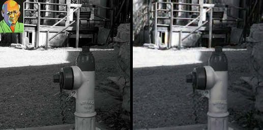
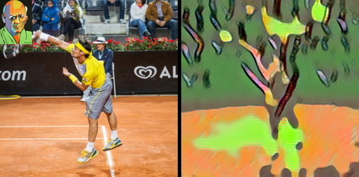

# StyleBank

**The experiment still has a lot of flaws and needs to be perfected in the future.**

A ~~complete(almost)~~ PyTorch Implementation of *StyleBank: An Explicit Representation for Neural Image Style Transfer*

Because there is not enough time, so this is still a bug version.

Now I face the following two questions:

1. The parameters in the paper can't run out of obvious results. I find the style loss is too low when I used paper's parameters (see the picture below).But you can change the $\alpha / \beta$'s value from 100 to 1000000,  and the style loss is big enough to generate stylized image.

   

   
fig1 low style loss result

2. A high-resolution style dataset need to be collected. I personally think that the resolution of the style image has a great effect on the result. But because it's the end of the semester, I have too little time.QAQ

BTW, I've ran the results of the experiment, but it's not satisfying. See it below.

The dataset is COCO_2017val(my computer's hard disk space is not enough for a lager dataset), I chose the first 1000 pictures from this dataset for training.

And you can see some result in *generate_image* folder, the codes is in *codes* folder.

QZQTechMonster gave me this great help in this experiment.